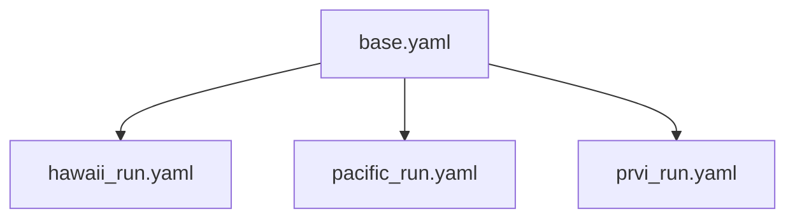
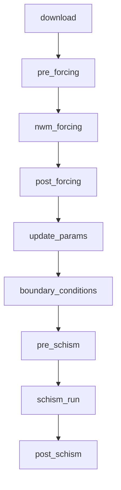
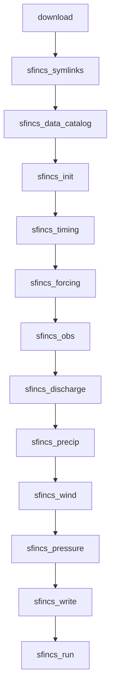
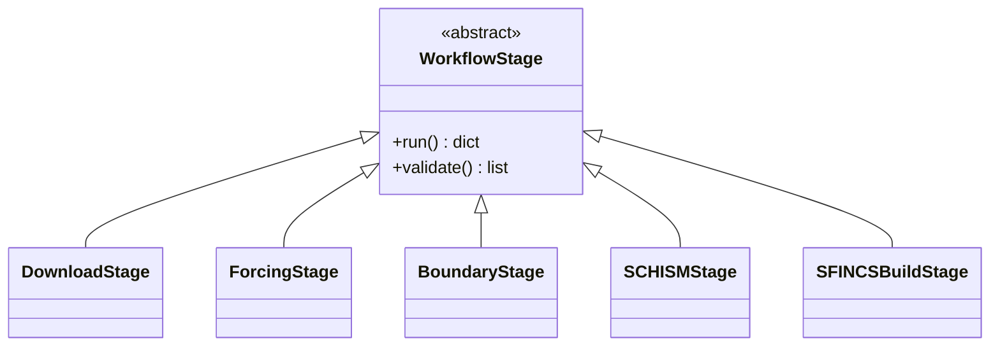
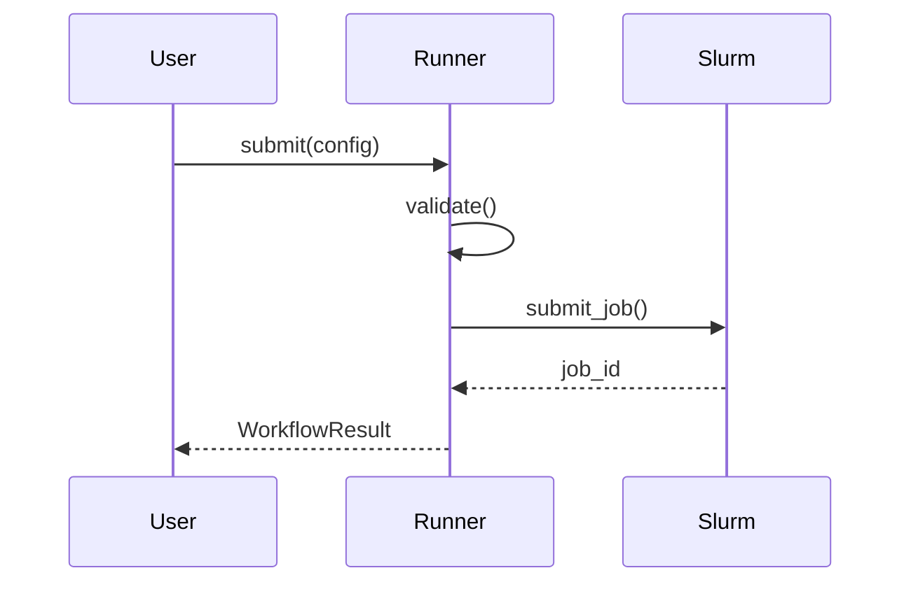

# coastal-calibration: Design Documentation

## Overview

The `coastal-calibration` Python package is a complete redesign and rewrite of the
original bash-based SCHISM model calibration workflow. This document details the
architectural improvements, design decisions, and substantial enhancements made over the
original implementation.

______________________________________________________________________

## Table of Contents

1. [Executive Summary](#executive-summary)
1. [Original Implementation Analysis](#original-implementation-analysis)
1. [New Architecture](#new-architecture)
1. [Key Design Decisions](#key-design-decisions)
1. [Substantial Improvements](#substantial-improvements)
1. [API Reference](#api-reference)
1. [Potential Future Developments](#potential-future-developments)

______________________________________________________________________

## Executive Summary

The `coastal-calibration` package provides a modern Python interface for running SCHISM
and SFINCS coastal model calibration workflows on HPC clusters. It wraps the existing
operational workflow scripts with a clean, type-safe API while establishing the
foundation for incremental improvements.

### Design Goals

The primary objectives of this rewrite are to create a workflow that is:

1. **Intuitive and user-friendly** - Simple YAML configuration, clear CLI commands,
    helpful error messages
1. **Less prone to errors** - Type-safe configuration, comprehensive validation,
    structured logging
1. **Extensible** - Polymorphic model architecture that supports SCHISM, SFINCS, and
    future models via a common `ModelConfig` ABC

### Architectural Strategy

The package is designed with a **stable public API** that shields users from internal
changes. This enables:

- **Immediate usability** - Users get a clean interface today, even while internals are
    being improved
- **Incremental rewriting** - Embedded bash scripts can be replaced with pure Python one
    stage at a time
- **Safe evolution** - Internal rewrites don't break user-facing code or configurations

The long-term goal is to **completely rewrite** all embedded bash scripts in Python, but
doing so incrementally allows the package to be useful immediately while that work
proceeds.

### Key Features

- **Type-safe configuration** via `dataclasses` with runtime validation
- **Modular stage-based architecture** for maintainability and extensibility
- **Native Python datetime handling** replacing fragile shell date arithmetic
- **Async data downloading** with built-in source validation
- **CLI and programmatic APIs** for both interactive and automated use
- **SLURM job management** with status monitoring
- **Progress tracking** and structured logging
- **Configuration inheritance** for DRY multi-run setups
- **Smart default paths** with variable interpolation

______________________________________________________________________

## Original Implementation Analysis

### File Structure (20+ scripts)

```console
calib_org/
├── sing_run.bash                     # Main entry point (258 lines)
├── schism_calib.cfg                  # Configuration file
├── pre_nwm_forcing_coastal.bash      # Forcing preparation
├── post_nwm_forcing_coastal.bash     # Forcing post-processing
├── make_tpxo_ocean.bash              # TPXO boundary conditions
├── pre_regrid_stofs.bash             # STOFS pre-processing
├── post_regrid_stofs.bash            # STOFS post-processing
├── update_param.bash                 # Parameter file updates (249 lines)
├── pre_schism.bash                   # SCHISM input preparation
├── post_schism.bash                  # SCHISM output processing
├── merge_source_sink.bash            # Discharge file merging
├── initial_discharge.bash            # Initial discharge creation
├── combine_sink_source.bash          # Sink/source combination
└── run_sing_coastal_workflow_*.bash  # 8+ Singularity wrappers
```

### Critical Issues in Original Implementation

#### 1. Fragile Date Arithmetic

The original workflow relied on external scripts for date calculations:

```bash
# Original: External script calls for every date operation
export FORCING_END_DATE=$(${USHnwm}/utils/advance_time.sh $PDY$cyc $LENGTH_HRS)'00'
pdycyc=$(${USHnwm}/utils/advance_time.sh $PDY$cyc $hr)
```

This approach had several problems:

- Required external `advance_time.sh` and `advance_cymdh.pl` scripts
- Shell spawning overhead for each date operation
- Inconsistent handling of edge cases (leap years, month boundaries)
- No error handling for invalid dates

#### 2. Environment Variable Pitfalls

The original scripts passed dozens of environment variables between scripts:

```bash
# Original configuration (schism_calib.cfg)
export STARTPDY=20230611
export STARTCYC=00
export FCST_LENGTH_HRS=3.0
export HOT_START_FILE=''
export USE_TPXO="NO"
export COASTAL_DOMAIN=pacific
export METEO_SOURCE=NWM_RETRO
export COASTAL_WORK_DIR=/efs/schism_use_case/...

# Plus 40+ more in sing_run.bash
export NGWPC_COASTAL_PARM_DIR=/ngen-test/coastal/ngwpc-coastal
export NGEN_APP_DIR=/ngen-app
export FCST_TIMESTEP_LENGTH_SECS=3600
export OTPSDIR=$NGEN_APP_DIR/OTPSnc
# ... etc
```

Problems:

- No validation of variable values
- Easy to have typos that fail silently
- Difficult to track variable dependencies
- No documentation of which variables are required vs optional

#### 3. String-Based Domain Mapping

```bash
# Original: Repeated in multiple files
declare -A coastal_domain_to_inland_domain=( \
    [prvi]="domain_puertorico" \
    [hawaii]="domain_hawaii" \
    [atlgulf]="domain" \
    [pacific]="domain" )

declare -A coastal_domain_to_nwm_domain=( \
    [prvi]="prvi" \
    [hawaii]="hawaii" \
    [atlgulf]="conus" \
    [pacific]="conus" )

declare -A coastal_domain_to_geo_grid=( \
    [prvi]="geo_em_PRVI.nc" \
    [hawaii]="geo_em_HI.nc" \
    [atlgulf]="geo_em_CONUS.nc" \
    [pacific]="geo_em_CONUS.nc" )
```

Problems:

- Duplicated across multiple scripts
- No compile-time type checking
- Silent failures on unknown domains

#### 4. No Data Download Integration

The original workflow required manual data downloading via a separate workflow. That
workflow had no date validation, no source awareness, and no progress tracking.

#### 5. Minimal Error Handling

```bash
# Original: Scripts would continue on failure
singularity exec -B $BINDINGS --pwd ${work_dir} $SIF_PATH \
    ./run_sing_coastal_workflow_pre_forcing_coastal.bash
# No error check here

${MPICOMMAND3} singularity exec -B $BINDINGS \
    --pwd ${work_dir} \
    $SIF_PATH \
    $CONDA_ENVS_PATH/$CONDA_ENV_NAME/bin/python \
    $USHnwm/wrf_hydro_workflow_dev/forcings/WrfHydroFECPP/workflow_driver.py
# No error check here either
```

______________________________________________________________________

## New Architecture

### Package Structure

```console
src/coastal_calibration/
├── __init__.py                  # Package exports
├── cli.py                       # Command-line interface
├── runner.py                    # Main workflow orchestrator
├── downloader.py                # Async data downloading
├── scripts_path.py              # Script path management
│
├── config/
│   ├── __init__.py
│   └── schema.py                # YAML config dataclasses + ModelConfig ABC
│
├── stages/                      # Workflow stages
│   ├── __init__.py
│   ├── base.py                  # Abstract WorkflowStage base class
│   ├── download.py              # Data download stage
│   ├── forcing.py               # NWM forcing stages
│   ├── boundary.py              # Boundary condition stages
│   ├── schism.py                # SCHISM execution stages
│   ├── sfincs.py                # SFINCS data catalog & symlinks
│   ├── sfincs_build.py          # SFINCS model build stages (HydroMT)
│   └── _hydromt_compat.py       # Compatibility patches for hydromt bugs
│
├── scripts/                     # Embedded bash scripts
│   ├── tpxo_to_open_bnds_hgrid/ # TPXO Python utilities
│   └── wrf_hydro_workflow_dev/  # WRF-Hydro forcing code
│
└── utils/
    ├── __init__.py
    ├── logging.py               # Workflow monitoring
    ├── slurm.py                 # SLURM job management
    ├── time.py                  # Datetime utilities
    └── workflow.py              # Workflow helper functions
```

### Core Components

#### 1. Configuration System (`config/schema.py`)

The new configuration system uses Python `dataclasses` with full type hints:

```python
from dataclasses import dataclass
from typing import Literal

CoastalDomain = Literal["prvi", "hawaii", "atlgulf", "pacific"]
MeteoSource = Literal["nwm_retro", "nwm_ana"]
BoundarySource = Literal["tpxo", "stofs"]


@dataclass
class SimulationConfig:
    """Simulation time and domain configuration."""

    start_date: datetime
    duration_hours: int
    coastal_domain: CoastalDomain
    meteo_source: MeteoSource
    timestep_seconds: int = 3600

    # Domain mappings as class variables
    _INLAND_DOMAIN: ClassVar[dict[str, str]] = {
        "prvi": "domain_puertorico",
        "hawaii": "domain_hawaii",
        "atlgulf": "domain",
        "pacific": "domain",
    }

    @property
    def start_pdy(self) -> str:
        """Return start date as YYYYMMDD string."""
        return self.start_date.strftime("%Y%m%d")

    @property
    def inland_domain(self) -> str:
        """Inland domain directory name for this coastal domain."""
        return self._INLAND_DOMAIN[self.coastal_domain]
```

Benefits:

- **Type safety**: IDE autocompletion, static analysis with `pyright`
- **Self-documenting**: Property names and docstrings explain purpose
- **Validation**: Runtime checks with helpful error messages
- **DRY**: Domain mappings defined once

#### 2. YAML Configuration with Inheritance

```yaml
# base.yaml - Shared defaults
slurm:
  partition: c5n-18xlarge

paths:
  nfs_mount: /ngen-test

---
# hawaii_run.yaml - Inherits from base
_base: base.yaml

simulation:
  start_date: '2023-06-11T00:00:00'
  duration_hours: 24
  coastal_domain: hawaii
  meteo_source: nwm_retro

paths:
  work_dir: /ngen-test/coastal_runs/${simulation.coastal_domain}
```

Features:

- **Variable interpolation**: `${section.key}` syntax
- **Inheritance**: `_base` field for configuration reuse
- **Deep merging**: Override only what changes
- **Smart defaults**: Minimal configuration required

When paths are not specified, they are automatically generated using templates that
include the `${model}` variable for model-aware directory naming:

```python
DEFAULT_WORK_DIR_TEMPLATE = (
    "/ngen-test/coastal/${slurm.user}/"
    "${model}_${simulation.coastal_domain}_${boundary.source}_${simulation.meteo_source}/"
    "${model}_${simulation.start_date}"
)

DEFAULT_RAW_DOWNLOAD_DIR_TEMPLATE = (
    "/ngen-test/coastal/${slurm.user}/"
    "${model}_${simulation.coastal_domain}_${boundary.source}_${simulation.meteo_source}/"
    "raw_data"
)
```



#### 3. Stage-Based Workflow Architecture

The stage pipeline is model-specific. Each `ModelConfig` subclass defines its own
`stage_order` and `create_stages()`.

**SCHISM pipeline:**



**SFINCS pipeline:**



Each stage is a Python class inheriting from `WorkflowStage`:



The base class implementation:

```python
class WorkflowStage(ABC):
    """Abstract base class for workflow stages."""

    name: str = "base"
    description: str = "Base workflow stage"

    def __init__(self, config: CoastalCalibConfig, monitor: WorkflowMonitor | None):
        self.config = config
        self.monitor = monitor

    def build_environment(self) -> dict[str, str]:
        """Build environment variables for the stage."""
        # Converts config to env vars for bash scripts
        env = os.environ.copy()
        env["STARTPDY"] = self.config.simulation.start_pdy
        env["STARTCYC"] = self.config.simulation.start_cyc
        # ... all precomputed, no shell date arithmetic needed
        return env

    def run_singularity_command(
        self,
        command: list[str],
        use_mpi: bool = False,
        mpi_tasks: int | None = None,
    ) -> subprocess.CompletedProcess[str]:
        """Run a command inside the Singularity container."""
        # Handles all Singularity setup, bindings, error checking
        pass

    @abstractmethod
    def run(self) -> dict[str, Any]:
        """Execute the stage and return results."""
        pass

    def validate(self) -> list[str]:
        """Validate stage prerequisites. Return list of errors."""
        return []
```

#### 4. Workflow Runner Orchestration

```python
class CoastalCalibRunner:
    """Main workflow runner for coastal model calibration."""

    @property
    def STAGE_ORDER(self) -> list[str]:
        """Stage order is delegated to the model config."""
        return self.config.model_config.stage_order

    def run(
        self,
        start_from: str | None = None,
        stop_after: str | None = None,
        dry_run: bool = False,
    ) -> WorkflowResult:
        """Execute the calibration workflow."""
        # Validation, stage sequencing, error handling, result collection
        pass

    def submit(self, wait: bool = False) -> WorkflowResult:
        """Submit workflow as a SLURM job.

        Parameters
        ----------
        wait : bool
            If True, wait for job completion with status updates.
            If False (default), return immediately after submission.
        """
        pass
```

The `submit()` method execution flow is shown in the sequence diagram below:



______________________________________________________________________

## Key Design Decisions

### 1. Python-Native Date Arithmetic

**Decision**: Replace all bash/Perl date scripts with Python `datetime`.

**Rationale**:

- Python's `datetime` and `timedelta` handle all edge cases correctly
- No external dependencies or shell spawning
- Type-safe with IDE support

**Implementation** (`utils/time.py`):

```python
_DATE_RE = re.compile(r"^\d{10}$")


def _parse_date(date_string: str) -> datetime:
    """Parse a YYYYMMDDHH string into a datetime, with strict validation."""
    if not isinstance(date_string, str) or not _DATE_RE.match(date_string):
        raise ValueError(
            f"date_string must be exactly 10 digits in YYYYMMDDHH format, got {date_string!r}"
        )
    return datetime.strptime(date_string, "%Y%m%d%H")


def advance_time(date_string: str, hours: int) -> str:
    """Advance a date string by a specified number of hours.

    Replaces advance_time.sh and advance_cymdh.pl with native Python.
    Handles leap years, month boundaries, DST, etc.
    """
    dt = _parse_date(date_string) + timedelta(hours=hours)
    return dt.strftime("%Y%m%d%H")
```

The module also consolidates `parse_datetime()` (flexible datetime parsing, previously
duplicated in `config.schema` and `downloader`) and `iter_hours()` (hour-range
iteration, previously in `downloader`).

**Impact**: The `build_environment()` method precomputes shared date-derived values,
then delegates model-specific env vars to `model_config.build_environment()`:

```python
# Shared dates computed once in Python, passed to bash scripts
env["FORCING_BEGIN_DATE"] = f"{pdycyc}00"
env["FORCING_END_DATE"] = forcing_end_dt.strftime("%Y%m%d%H00")
env["END_DATETIME"] = forcing_end_dt.strftime("%Y%m%d%H")

# Model-specific env vars (e.g., SCHISM_BEGIN_DATE, OMP_NUM_THREADS)
env = self.config.model_config.build_environment(env, self.config)
```

### 2. Integrated Data Downloading with Validation

**Decision**: Build a comprehensive downloader with source awareness and date range
validation.

**Rationale**:

- Different data sources have different availability windows
- Users shouldn't waste time on downloads that will fail
- Async downloading is faster than sequential

**Implementation** (`downloader.py`):

```python
DATA_SOURCE_DATE_RANGES: dict[str, dict[str, DateRange]] = {
    "nwm_retro": {
        "conus": DateRange(
            start=datetime(1979, 2, 1),
            end=datetime(2023, 1, 31),
            description="NWM Retrospective 3.0 (CONUS)",
        ),
        "hawaii": DateRange(
            start=datetime(1994, 1, 1),
            end=datetime(2013, 12, 31),
            description="NWM Retrospective 3.0 (Hawaii)",
        ),
        # ...
    },
    "stofs": {
        "_default": DateRange(
            start=datetime(2020, 12, 30),
            end=None,  # operational, no end date
            description="STOFS (operational)",
        ),
    },
}


def download_data(
    start_time: datetime,
    end_time: datetime,
    output_dir: Path,
    domain: Domain,
    meteo_source: MeteoSource = "nwm_retro",
    coastal_source: CoastalSource = "stofs",
) -> DownloadResults:
    """Download with validation and progress tracking."""
    # Validates dates before downloading
    errors = _validate_date_ranges(start, end, meteo_source, coastal_source, domain)
    if errors:
        raise ValueError("Date range validation failed:\n" + "\n".join(errors))

    # Uses tiny_retriever for async parallel downloads
    download(urls, paths, timeout=timeout)
```

### 3. Configuration Over Convention

**Decision**: Use explicit YAML configuration with sensible defaults.

**Rationale**:

- Original relied on implicit conventions (file locations, naming patterns)
- Explicit configuration is self-documenting
- Easier to version control and share

**Example SCHISM configuration**:

```yaml
slurm:
  job_name: coastal_calibration
  partition: c5n-18xlarge

simulation:
  start_date: '2023-06-11T00:00:00'
  duration_hours: 24
  coastal_domain: pacific
  meteo_source: nwm_retro

boundary:
  source: tpxo  # or: source: stofs

paths:
  work_dir: /ngen-test/coastal_runs/my_run
  raw_download_dir: /ngen-test/data/downloads

# SCHISM compute parameters (model_config defaults to SchismModelConfig)
model_config:
  nodes: 2
  ntasks_per_node: 18
  nscribes: 2
  omp_num_threads: 2

download:
  enabled: true
  skip_existing: true
```

**Example SFINCS configuration**:

```yaml
model: sfincs

slurm:
  job_name: sfincs_texas

simulation:
  start_date: 2025-06-01
  duration_hours: 168
  coastal_domain: atlgulf
  meteo_source: nwm_ana

boundary:
  source: stofs

model_config:
  prebuilt_dir: /path/to/texas/model
  include_noaa_gages: true
  forcing_to_mesh_offset_m: 0.0    # STOFS already in mesh datum
  vdatum_mesh_to_msl_m: 0.171      # mesh datum → MSL for obs comparison
  omp_num_threads: 36

download:
  enabled: true
  skip_existing: true
```

### 4. Non-Interactive Default with Interactive Flag

**Decision**: The `submit` command returns immediately by default, with an optional
`--interactive` (`-i`) flag to wait for completion.

**Rationale**:

- Matches standard `sbatch` behavior that users expect
- Allows users to submit jobs and continue working
- Interactive mode available when monitoring is desired

**CLI behavior**:

```bash
# Default: Submit and return immediately (like sbatch)
coastal-calibration submit config.yaml

# Interactive: Wait for completion with status updates
coastal-calibration submit config.yaml --interactive
coastal-calibration submit config.yaml -i
```

### 5. Direct Execution Inside SLURM Jobs (`run` Command)

**Decision**: Provide a `run` command for direct, in-process execution alongside the
`submit` command.

**Rationale**:

The `submit` command handles job submission automatically, but users often need full
control over SLURM resource allocation—for example when using non-default partitions,
requesting specific hardware, or embedding the workflow in a larger pipeline. The `run`
command fills this gap: it executes all stages locally on whatever resources are already
allocated, making it ideal for use inside manually written `sbatch` scripts.

**Usage pattern**:

Users write a `sbatch` script that creates a YAML configuration inline (using a heredoc)
and passes it to `coastal-calibration run`. The SLURM directives in the `sbatch` script
control resource allocation, while the YAML controls workflow configuration:

```bash
#!/usr/bin/env bash
#SBATCH --job-name=coastal_schism
#SBATCH -N 2
#SBATCH --ntasks-per-node=18

CONFIG_FILE="/tmp/coastal_config_${SLURM_JOB_ID}.yaml"

cat > "${CONFIG_FILE}" <<'EOF'
model: schism

simulation:
  start_date: 2021-01-01
  duration_hours: 12
  coastal_domain: hawaii
  meteo_source: nwm_retro
boundary:
  source: tpxo
EOF

coastal-calibration run "${CONFIG_FILE}"
rm -f "${CONFIG_FILE}"
```

**Design choices**:

- The config filename includes `$SLURM_JOB_ID` to avoid collisions when multiple jobs
    run concurrently
- Single-quoted heredoc (`<<'EOF'`) prevents accidental shell variable expansion inside
    the YAML
- `run` reuses the same stage pipeline as `submit`—the only difference is execution
    context (in-process vs. SLURM job submission)
- Complete examples for both SCHISM and SFINCS are provided in `docs/examples/`

### 6. Stable Public API with Incremental Internal Rewrite

**Decision**: Establish a clean, stable public API while embedding existing scripts as a
transitional measure.

**Rationale**:

The primary goal of this rewrite is to create an **intuitive, user-friendly, and
extensible** workflow system. The existing bash and Python scripts are difficult to
maintain and not performant. However, rewriting everything at once would:

- Delay delivery of a usable tool to users
- Risk introducing regressions without a baseline
- Require extensive testing before any release

**Strategy**:

The architecture deliberately separates **public API** from **private implementation**:

| Layer                      | Components                                                   | Stability |
| -------------------------- | ------------------------------------------------------------ | --------- |
| **Public API**             | `CoastalCalibConfig`, `CoastalCalibRunner`, CLI              | Stable    |
| **Stage Interface**        | `WorkflowStage.run()`, `.validate()`, `.build_environment()` | Stable    |
| **Private Implementation** | Bash scripts → Pure Python                                   | Evolving  |

This allows:

1. **Users get a stable interface today** - The CLI and Python API won't change as
    internals evolve
1. **Incremental rewriting** - Each stage can be rewritten independently without
    affecting others
1. **Testing baseline first** - Establish test coverage against current behavior before
    changes
1. **Performance optimization** - Replace bash subprocess calls with native Python as
    needed

**Current State**:

- Package includes `scripts/` directory with embedded bash scripts
- `WorkflowStage.run_singularity_command()` provides abstraction layer
- Python precomputes all environment variables, minimizing bash complexity

**Future Direction**:

1. Add comprehensive integration tests capturing current behavior
1. Incrementally rewrite stages in pure Python (starting with simpler stages)
1. Deprecate bash scripts as Python replacements are validated
1. Optimize performance-critical paths (file I/O, data processing)

### 7. Strict Type Checking with `pyright`

**Decision**: Use strict `pyright` mode for static type analysis.

**Rationale**:

- Catches errors before runtime
- Enables IDE features (autocomplete, refactoring)
- Self-documents function signatures

**Configuration** (`pyproject.toml`):

```toml
[tool.pyright]
typeCheckingMode = "strict"
include = ["src/coastal_calibration"]
```

______________________________________________________________________

## Substantial Improvements

### 1. Error Handling and Validation

| Aspect                   | Original        | New                                            |
| ------------------------ | --------------- | ---------------------------------------------- |
| Configuration validation | None            | 12+ checks in `CoastalCalibConfig.validate()`  |
| Stage validation         | None            | Each stage has `validate()` method             |
| Error messages           | Exit codes only | Detailed, actionable messages                  |
| Recovery                 | Manual restart  | Partial workflow execution with `--start-from` |

**Validation examples**:

```python
def validate(self) -> list[str]:
    errors = []

    # Shared validation
    if self.simulation.duration_hours <= 0:
        errors.append("simulation.duration_hours must be positive")

    if (
        self.boundary.source == "stofs"
        and not self.boundary.stofs_file
        and not self.download.enabled
    ):
        errors.append(
            "boundary.stofs_file required when using STOFS source and download is disabled"
        )

    # Model-specific validation (delegated to ModelConfig subclass)
    errors.extend(self.model_config.validate(self))

    return errors
```

### 2. Progress Tracking and Monitoring

**Original**: No progress tracking, just log messages scattered in bash scripts.

**New**: Structured monitoring with stage context:

```python
class WorkflowMonitor:
    """Monitors and logs workflow execution progress."""

    def register_stages(self, stages: list[str]) -> None:
        """Register stages for progress tracking."""

    @contextmanager
    def stage_context(self, stage_name: str, description: str):
        """Context manager for stage execution with timing."""
        self.info(f"Starting stage: {stage_name} - {description}")
        start = time.perf_counter()
        try:
            yield
            duration = time.perf_counter() - start
            self.info(f"Completed stage: {stage_name} in {duration:.1f}s")
            self.progress[stage_name] = "completed"
        except Exception as e:
            self.progress[stage_name] = "failed"
            raise

    def save_progress(self, path: Path) -> None:
        """Save progress to JSON for resumption."""
```

### 3. SLURM Integration

**Original**: Manual SLURM script writing, no job tracking.

**New**: Full `SlurmManager` class:

```python
class SlurmManager:
    """Manage SLURM job submission and monitoring."""

    def submit_job(self, script_path: Path) -> str:
        """Submit and return job ID."""

    def get_job_status(self, job_id: str) -> JobStatus:
        """Query job status from sacct/squeue."""

    def wait_for_job(self, job_id: str, poll_interval: int = 30) -> JobStatus:
        """Block until job completes, logging state transitions."""

    def generate_job_script(self, output_path: Path) -> Path:
        """Generate SLURM script from configuration."""
```

### 4. CLI with Multiple Entry Points

```bash
# Initialize configuration for a domain
coastal-calibration init config.yaml --domain hawaii

# Validate configuration
coastal-calibration validate config.yaml

# Run directly (for testing)
coastal-calibration run config.yaml --dry-run

# Submit to SLURM cluster
coastal-calibration submit config.yaml

# Run partial workflow
coastal-calibration run config.yaml --start-from update_params --stop-after boundary_conditions

# List available stages
coastal-calibration stages
```

### 5. Dual API: CLI and Programmatic

```python
# Python API
from coastal_calibration import CoastalCalibConfig, CoastalCalibRunner

config = CoastalCalibConfig.from_yaml("config.yaml")
runner = CoastalCalibRunner(config)

# Validate first
errors = runner.validate()
if errors:
    print("Validation failed:", errors)
else:
    result = runner.submit()
    print(f"Job {result.job_id}: {result.success}")
```

### 6. Comprehensive Downloader

| Feature           | Original       | New                               |
| ----------------- | -------------- | --------------------------------- |
| Data sources      | Manual AWS CLI | NWM Retro, NWM Ana, STOFS, GLOFS  |
| Date validation   | None           | Checks against known availability |
| Parallel download | None           | Async with `tiny_retriever`       |
| Skip existing     | None           | `skip_existing=True` option       |
| Progress tracking | None           | Success/failure counts            |
| Domain awareness  | Manual         | Automatic URL building            |

### 7. Results Serialization

```python
@dataclass
class WorkflowResult:
    success: bool
    job_id: str | None
    start_time: datetime
    end_time: datetime | None
    stages_completed: list[str]
    stages_failed: list[str]
    outputs: dict[str, Any]
    errors: list[str]

    @property
    def duration_seconds(self) -> float | None:
        if self.end_time:
            return (self.end_time - self.start_time).total_seconds()
        return None

    def save(self, path: Path) -> None:
        """Save result to JSON for post-processing."""
```

______________________________________________________________________

## API Reference

### Configuration Classes

| Class                | Purpose                                        |
| -------------------- | ---------------------------------------------- |
| `CoastalCalibConfig` | Root configuration container                   |
| `SlurmConfig`        | SLURM scheduling parameters                    |
| `SimulationConfig`   | Time, domain, and source settings              |
| `BoundaryConfig`     | TPXO vs STOFS selection                        |
| `PathConfig`         | All file and directory paths                   |
| `ModelConfig`        | ABC for model-specific configuration           |
| `SchismModelConfig`  | SCHISM compute, MPI, and stage settings        |
| `SfincsModelConfig`  | SFINCS model paths, OpenMP, and stage settings |
| `MonitoringConfig`   | Logging and progress tracking                  |
| `DownloadConfig`     | Data download settings                         |

### SCHISM Workflow Stages

| Stage                 | Class                    | Description                              |
| --------------------- | ------------------------ | ---------------------------------------- |
| `download`            | `DownloadStage`          | Download NWM/STOFS/GLOFS data            |
| `pre_forcing`         | `PreForcingStage`        | Prepare forcing directories and symlinks |
| `nwm_forcing`         | `NWMForcingStage`        | Run WRF-Hydro forcing engine (MPI)       |
| `post_forcing`        | `PostForcingStage`       | Post-process forcing files               |
| `update_params`       | `UpdateParamsStage`      | Generate SCHISM `param.nml`              |
| `boundary_conditions` | `BoundaryConditionStage` | TPXO or STOFS boundary generation        |
| `pre_schism`          | `PreSCHISMStage`         | Prepare SCHISM inputs                    |
| `schism_run`          | `SCHISMRunStage`         | Execute `pschism` binary (MPI)           |
| `post_schism`         | `PostSCHISMStage`        | Validate and post-process outputs        |

### SFINCS Workflow Stages

| Stage                 | Class                      | Description                                                     |
| --------------------- | -------------------------- | --------------------------------------------------------------- |
| `download`            | `DownloadStage`            | Download NWM/STOFS data                                         |
| `sfincs_symlinks`     | `SFINCSSymlinksStage`      | Create `.nc` symlinks for NWM data                              |
| `sfincs_data_catalog` | `SFINCSDataCatalogStage`   | Generate HydroMT data catalog                                   |
| `sfincs_init`         | `SfincsInitStage`          | Initialize SFINCS model + clean stale files                     |
| `sfincs_timing`       | `SfincsTimingStage`        | Set SFINCS timing                                               |
| `sfincs_forcing`      | `SfincsForcingStage`       | Add water level forcing (IDW interpolation)                     |
| `sfincs_obs`          | `SfincsObsStage`           | Add observation points                                          |
| `sfincs_discharge`    | `SfincsDischargeStage`     | Add discharge sources (active-cell filter)                      |
| `sfincs_precip`       | `SfincsPrecipitationStage` | Add precipitation forcing + clip meteo grid                     |
| `sfincs_wind`         | `SfincsWindStage`          | Add wind forcing + clip meteo grid                              |
| `sfincs_pressure`     | `SfincsPressureStage`      | Add pressure forcing + clip meteo grid                          |
| `sfincs_write`        | `SfincsWriteStage`         | Write SFINCS model                                              |
| `sfincs_run`          | `SfincsRunStage`           | Run SFINCS (Singularity/OpenMP)                                 |
| `sfincs_plot`         | `SfincsPlotStage`          | Plot simulated vs observed water levels (with datum conversion) |

______________________________________________________________________

## Potential Future Developments

### Vision: Unified Workflow Architecture

The overarching goal is to make the SCHISM and SFINCS workflows architecturally
consistent. Every coastal model workflow is conceptually the same four-phase pipeline:

```console
Model Creation ──► Model Preparation ──► Model Execution ──► Evaluation
(mesh, config)   (forcing, boundaries)   (run the solver)   (obs vs sim)
```

The SFINCS workflow already follows this pattern cleanly: users provide a pre-built
model (`prebuilt_dir`), the Python pipeline adds forcing/boundaries/observations, then a
single container call runs the solver. The SCHISM workflow, by contrast, conflates model
creation and preparation inside monolithic bash scripts with hardcoded paths to a
pre-built model on the cluster. The future direction is to bring SCHISM in line with
SFINCS.

The end state is three purpose-built containers, one per concern:

| Container           | Purpose                                                      | Invocation                           |
| ------------------- | ------------------------------------------------------------ | ------------------------------------ |
| **SFINCS**          | SFINCS solver (OpenMP, single-node)                          | `singularity run` (entrypoint-based) |
| **SCHISM**          | SCHISM solver + mesh partitioning (MPI, multi-node)          | `singularity exec` (single call)     |
| **ESMF regridding** | NWM forcing + STOFS boundary regridding (MPI Python + ESMPy) | `singularity exec` (single call)     |

### Current State: SCHISM vs SFINCS Architectural Gap

| Aspect                  | SFINCS (target pattern)             | SCHISM (current)                              |
| ----------------------- | ----------------------------------- | --------------------------------------------- |
| **Model input**         | `prebuilt_dir` (user-provided)      | Hardcoded paths in `/ngwpc-coastal/parm/`     |
| **Model manipulation**  | Python (HydroMT-SFINCS library)     | Bash scripts inside Singularity               |
| **Forcing generation**  | Pure Python (`xarray`, `rasterio`)  | MPI Python + bash wrappers (container)        |
| **Boundary conditions** | Pure Python (IDW interpolation)     | Fortran binary (`predict_tide`) or MPI Python |
| **Configuration**       | `sfincs.inp` read/written by Python | `param.nml` generated by 230-line bash        |
| **Container usage**     | Single call (`singularity run`)     | 9 separate `singularity exec` calls           |
| **Pre-run stages**      | 12 stages, 11 pure Python           | 9 stages, only 2 pure Python                  |
| **Bash dependency**     | 0 bash scripts                      | 15 bash scripts (~1,000 lines)                |
| **Embedded Python**     | 0 (all in package proper)           | 6 scripts (~1,100 lines) in `scripts/`        |

**What the current monolithic Singularity container bundles:**

- `pschism` binary (the SCHISM solver, compiled with MPI + ParMETIS)
- `metis_prep` and `gpmetis` binaries (mesh partitioning for parallel execution)
- `combine_hotstart7` binary (hot-start file post-processing)
- `predict_tide` (OTPS Fortran binary for TPXO tidal prediction)
- Conda environments with ESMF-based Python scripts
- All of the above run via 9 separate `singularity exec` calls per workflow

### Phase 1: Pre-Built SCHISM Model (`prebuilt_dir`)

**Goal**: Accept a pre-built SCHISM model directory, just like SFINCS.

A pre-built SCHISM model directory would contain the mesh and static configuration:

```console
prebuilt_dir/
  hgrid.gr3           # Unstructured mesh (required)
  hgrid.nc            # Same mesh in NetCDF (required for ESMF regridding)
  vgrid.in            # Vertical grid specification
  param.nml.template  # Namelist template (dates/paths filled at runtime)
  bctides.in          # Tidal boundary setup (optional, for TPXO)
  station.in          # Observation stations (optional, auto-generated if absent)
```

Currently, these files live at hardcoded cluster paths
(`${parm_dir}/parm/coastal/{domain}/`) and are symlinked into the work directory by
`update_param.bash`. The refactoring moves them into a user-provided directory:

**Changes required:**

1. Add `prebuilt_dir: Path` to `SchismModelConfig` (mirrors `SfincsModelConfig`)
1. Add validation that `prebuilt_dir` contains required files
1. Replace the symlink logic in `update_params` bash with a Python init stage that
    copies/symlinks from `prebuilt_dir` to `work_dir`
1. Replace `param.nml` generation (currently 230 lines of bash in `update_param.bash`)
    with Python using `f90nml` to read the template and fill runtime values
1. Remove the `parm_dir` and `nwm_dir` path dependencies from `PathConfig`

**Backward compatibility**: The current `parm_dir`-based paths can be preserved as a
fallback: if `prebuilt_dir` is not set, construct it from
`${parm_dir}/parm/coastal/{domain}/` to maintain cluster compatibility during
transition.

### Phase 2: Pure-Python Model Preparation

**Goal**: Rewrite all pre-run SCHISM stages in pure Python, eliminating the bash scripts
and the need to run preparation stages inside the Singularity container.

**Stage-by-stage rewrite plan:**

| Stage             | Current                        | Replacement                       |
| ----------------- | ------------------------------ | --------------------------------- |
| `update_params`   | `update_param.bash` (230 LOC)  | `f90nml` template fill            |
| `pre_forcing`     | `pre_nwm_forcing_coastal.bash` | `pathlib` + `shutil` (symlinks)   |
| `post_forcing`    | `makeAtmo.py` (232 LOC)        | Absorb into package as module     |
| `boundary (TPXO)` | `predict_tide` Fortran binary  | pure Python TPXO                  |
| `pre_schism`      | `pre_schism.bash` (56 LOC)     | `makeDischarge.py` already Python |
| `post_schism`     | `post_schism.bash` (37 LOC)    | `pathlib` + NetCDF4 checks        |

**Scripts that can be absorbed immediately** (already Python, just need to move out of
`scripts/` into proper package modules):

- `makeAtmo.py` (232 LOC) - atmospheric post-processing
- `makeDischarge.py` (139 LOC) - discharge source generation
- `merge_source_sink.py` (166 LOC) - source/sink merging
- `correct_elevation.py` (32 LOC) - elevation correction
- `otps_to_open_bnds_hgrid.py` (108 LOC) - TPXO output parsing

These 5 Python files total ~677 lines and are already functional Python code that just
needs to be brought under the package's type checking, testing, and import system.

### Phase 3: Three Purpose-Built Containers

**Goal**: Replace the current monolithic container with three focused containers, each
with a single responsibility.

#### SFINCS Container (already exists)

The SFINCS container already follows the target pattern. It contains only the SFINCS
solver binary with OpenMP support and is invoked via a single `singularity run` call
with the model directory bind-mounted at `/data`.

#### SCHISM Container (new, solver only)

A minimal container with only the binaries needed to run and partition a SCHISM model:

- `pschism` (the SCHISM solver, compiled with MPI + NetCDF)
- `metis_prep` + `gpmetis` (mesh partitioning for parallel execution)
- `combine_hotstart7` (combines distributed hot-start files after a run)
- OpenMPI runtime and InfiniBand/network libraries for multi-node MPI
- HDF5/NetCDF4 Fortran libraries

This container is invoked twice: once for mesh partitioning (`metis_prep` + `gpmetis`)
and once for the solver (`mpiexec pschism`). Both are simple `singularity exec` calls.

**Removed from container** (moved to host-side Python):

- All bash wrapper scripts
- Conda environments
- `predict_tide` (replaced by pure Python TPXO)
- NWM USH/EXEC scripts

#### ESMF Regridding Container (new, MPI Python + ESMPy)

The NWM forcing engine (`workflow_driver.py`) and STOFS boundary regridding
(`regrid_estofs.py`) both depend on ESMPy (`import ESMF`), which is the Python interface
to the ESMF (Earth System Modeling Framework) regridding library. ESMPy itself requires
MPI and performs parallel regridding of NWM meteorological fields (wind, pressure,
precipitation) and STOFS water levels onto the SCHISM unstructured mesh.

These ESMF dependencies are heavyweight (MPI-aware C/Fortran libraries + Python
bindings) and do not belong in either the SCHISM solver container or the host Python
environment. A dedicated ESMF container isolates this concern:

- ESMPy (`ESMF` Python module) with MPI support
- `workflow_driver.py` - regrids NWM forcing fields to SCHISM mesh via ESMF
- `regrid_estofs.py` - regrids STOFS water levels to SCHISM open boundaries via ESMF
- Python scientific stack (numpy, netCDF4, xarray)
- OpenMPI runtime matching the cluster

This container is invoked via `singularity exec` with `mpiexec` for the two ESMF-based
stages (`nwm_forcing` and STOFS `boundary_conditions`). This is the last container to
address since both scripts are already functional MPI Python programs.

#### Target Architecture

```
Host (Python)                    Containers
──────────────                   ──────────
download          ─── pure Python (no container)
pre_forcing       ─── pure Python (no container)
nwm_forcing       ─── ESMF container (mpiexec + workflow_driver.py)
post_forcing      ─── pure Python (no container)
update_params     ─── pure Python (no container)
schism_obs        ─── pure Python (no container)
boundary (TPXO)   ─── pure Python (no container)
boundary (STOFS)  ─── ESMF container (mpiexec + regrid_estofs.py)
pre_schism        ─── SCHISM container (metis_prep + gpmetis)
schism_run        ─── SCHISM container (mpiexec + pschism)
post_schism       ─── pure Python (no container)
schism_plot       ─── pure Python (no container)
```

**Bind mounts** simplified from 15+ to 2-3 per container (work_dir + MPI libs).

### Phase 4: Evaluation and Visualization

**Goal**: Expand the existing `schism_plot` and `sfincs_plot` stages into a unified
evaluation framework.

Both `SchismPlotStage` and `SfincsPlotStage` are already pure Python, query NOAA CO-OPS
observations, and generate comparison plots. Future enhancements:

1. Unified `EvaluationStage` base class for both models
1. Statistical metrics (RMSE, bias, correlation, skill scores)
1. Multi-station summary dashboards
1. Time series export (CSV/Parquet) for downstream analysis

### Near-Term Priorities

1. **Pure-Python TPXO** - Replaces the `predict_tide` Fortran binary and eliminates the
    SFINCS workflow's only Singularity dependency for boundary conditions.

1. **Absorb embedded Python scripts** - The 5 Python files in `scripts/` (677 LOC) are
    already functional Python. Moving them into the package proper brings them under
    type checking, testing, and import hygiene with minimal risk.

1. **`f90nml`-based `param.nml` generation** - Replaces the largest bash script
    (`update_param.bash`, 230 LOC) and unblocks the `prebuilt_dir` pattern.

### Feature Expansion

1. **Hot Start Chain Automation**

    - Automatic hot-start file discovery
    - Multi-run chaining for long simulations

1. **Ensemble Runs**

    - Multiple configurations from single base
    - Parallel SLURM array jobs

1. **Cloud-Native Deployment**

    - AWS Batch support
    - Container-native execution (no Singularity)

______________________________________________________________________

## Conclusion

The `coastal-calibration` package represents a substantial modernization of the original
bash-based workflow:

| Metric          | Original              | New                     | Improvement      |
| --------------- | --------------------- | ----------------------- | ---------------- |
| Lines of bash   | ~2,500                | ~500 (embedded)         | 80% reduction    |
| Lines of Python | ~200 (scattered)      | ~4,000 (structured)     | Full rewrite     |
| Configuration   | Environment variables | Typed YAML              | Type-safe        |
| Error handling  | Exit codes            | Exceptions + validation | Comprehensive    |
| Testing         | None                  | `pytest` + `pyright`    | CI-ready         |
| Documentation   | Comments only         | Docstrings + types      | Self-documenting |
| Extensibility   | Copy & modify scripts | Inherit `WorkflowStage` | Object-oriented  |
| Model support   | SCHISM only           | SCHISM + SFINCS         | Polymorphic      |

The architecture is designed for maintainability, extensibility, and correctness while
supporting multiple coastal models (SCHISM and SFINCS) through a polymorphic
`ModelConfig` ABC and preserving compatibility with the existing HPC infrastructure.
