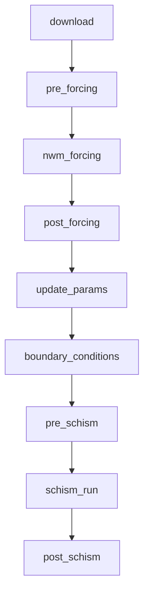
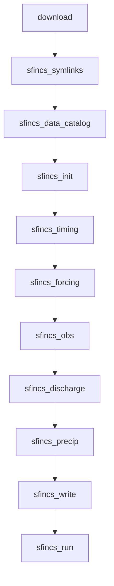

# Workflow Stages

The coastal calibration workflow consists of sequential stages, each performing a
specific task in the simulation pipeline. The stage order depends on the selected model
(SCHISM or SFINCS).

## SCHISM Stage Overview



## SFINCS Stage Overview



## SCHISM Stage Details

### 1. download

**Purpose:** Download required input data from remote sources.

**Data Sources:**

- NWM meteorological forcing (LDASIN files)
- NWM streamflow data (CHRTOUT files)
- STOFS or GLOFS water level data (when applicable)

**Runs On:** Login node (before SLURM job submission)

**Outputs:**

```
raw_download_dir/
├── meteo/nwm_ana/
│   └── *.LDASIN_DOMAIN1.nc
├── hydro/nwm/
│   └── *.CHRTOUT_DOMAIN1.nc
└── coastal/stofs/
    └── *.fields.cwl.nc
```

### 2. pre_forcing

**Purpose:** Prepare NWM forcing data for SCHISM.

**Tasks:**

- Copy and organize downloaded NWM files
- Set up directory structure for forcing generation
- Validate input data integrity

**Runs On:** Compute node (inside Singularity)

### 3. nwm_forcing

**Purpose:** Generate atmospheric forcing files using MPI.

**Tasks:**

- Regrid NWM data to SCHISM mesh
- Interpolate forcing variables
- Generate SCHISM-compatible forcing files

**Runs On:** Compute node (MPI parallel, inside Singularity)

**Outputs:**

```
work_dir/
└── sflux/
    ├── sflux_air_1.*.nc
    ├── sflux_prc_1.*.nc
    └── sflux_rad_1.*.nc
```

### 4. post_forcing

**Purpose:** Post-process forcing data.

**Tasks:**

- Validate generated forcing files
- Create forcing summary
- Clean up temporary files

**Runs On:** Compute node (inside Singularity)

### 5. update_params

**Purpose:** Generate SCHISM parameter file.

**Tasks:**

- Create `param.nml` with simulation parameters
- Set time stepping configuration
- Configure output options

**Runs On:** Compute node (inside Singularity)

**Outputs:**

```
work_dir/
└── param.nml
```

### 6. boundary_conditions

**Purpose:** Generate boundary conditions from TPXO or STOFS.

**Tasks (TPXO):**

- Extract tidal constituents at boundary nodes
- Generate harmonic boundary files
- Create `bctides.in` file

**Tasks (STOFS):**

- Interpolate STOFS water levels to boundary
- Generate time-varying boundary files
- Create `elev2D.th.nc` file

**Runs On:** Compute node (inside Singularity)

### 7. pre_schism

**Purpose:** Final preparation before SCHISM execution.

**Tasks:**

- Validate all input files present
- Set up symbolic links
- Configure MPI environment

**Runs On:** Compute node (inside Singularity)

### 8. schism_run

**Purpose:** Execute the SCHISM model.

**Tasks:**

- Run SCHISM with MPI
- Monitor progress
- Handle I/O scribes

**Runs On:** Compute node (MPI parallel, inside Singularity)

**Configuration:**

- Uses `nscribes` I/O processes from model config
- OpenMP threads configured via `omp_num_threads`
- Total processes = `nodes * ntasks_per_node`

### 9. post_schism

**Purpose:** Post-process SCHISM outputs.

**Tasks:**

- Combine output files
- Generate statistics
- Create visualization-ready files

**Runs On:** Compute node (inside Singularity)

## SFINCS Stage Details

### 1. download

Same as SCHISM download stage. Downloads NWM meteorological forcing, streamflow, and
STOFS water level data.

### 2. sfincs_symlinks

**Purpose:** Create .nc symlinks for NWM data.

**Tasks:**

- Create symlinks in the working directory pointing to downloaded NWM files
- Organize files by type (meteo, hydro)

### 3. sfincs_data_catalog

**Purpose:** Generate a HydroMT data catalog.

**Tasks:**

- Build YAML data catalog for HydroMT-SFINCS
- Register NWM meteo, streamflow, and STOFS data sources

### 4. sfincs_init

**Purpose:** Initialise the SFINCS model from a pre-built template.

**Tasks:**

- Load pre-built SFINCS model from `prebuilt_dir`
- Set up model directory structure

### 5. sfincs_timing

**Purpose:** Set SFINCS model timing.

**Tasks:**

- Configure simulation start/end times
- Set output intervals

### 6. sfincs_forcing

**Purpose:** Add water level forcing.

**Tasks:**

- Interpolate STOFS water levels to SFINCS boundary points
- Generate boundary forcing files

### 7. sfincs_obs

**Purpose:** Add observation points.

**Tasks:**

- Add tide gauge locations from `observation_points`
- Configure observation output

### 8. sfincs_discharge

**Purpose:** Add discharge sources.

**Tasks:**

- Add NWM streamflow discharge points from `discharge_locations_file`
- Generate discharge forcing time series

### 9. sfincs_precip

**Purpose:** Add precipitation forcing.

**Tasks:**

- Add NWM precipitation data as spatially distributed forcing

### 10. sfincs_write

**Purpose:** Write the final SFINCS model.

**Tasks:**

- Write all SFINCS input files (`sfincs.inp`, `sfincs.bnd`, etc.)
- Generate boundary and forcing NetCDF files

### 11. sfincs_run

**Purpose:** Execute the SFINCS model.

**Tasks:**

- Run SFINCS inside Singularity container
- Uses single-node OpenMP parallelism (`omp_num_threads`)

**Runs On:** Compute node (OpenMP, inside Singularity)

## Running Partial Workflows

### CLI

```bash
# SCHISM examples
coastal-calibration run config.yaml --stop-after download
coastal-calibration run config.yaml --start-from pre_forcing --stop-after post_forcing
coastal-calibration run config.yaml --start-from boundary_conditions

# SFINCS examples
coastal-calibration run config.yaml --stop-after sfincs_write
coastal-calibration run config.yaml --start-from sfincs_run
```

### Python API

```python
from coastal_calibration import CoastalCalibConfig, CoastalCalibRunner

config = CoastalCalibConfig.from_yaml("config.yaml")
runner = CoastalCalibRunner(config)

# Run specific stages
result = runner.run(start_from="pre_forcing", stop_after="post_forcing")
```

## Error Handling

If a stage fails:

1. The workflow stops at the failed stage
1. Error details are logged
1. Subsequent stages are not executed
1. Exit code indicates failure

To resume after fixing an issue:

```bash
# Resume from the failed stage
coastal-calibration run config.yaml --start-from <failed_stage>
```

## Stage Timing

When `enable_timing` is true in the monitoring configuration, stage durations are
tracked and reported:

```console
Stage timing:
  download: 45.2s
  pre_forcing: 12.3s
  nwm_forcing: 234.5s
  post_forcing: 8.7s
  update_params: 2.1s
  boundary_conditions: 156.8s
  pre_schism: 5.4s
  schism_run: 1823.6s
  post_schism: 67.2s
Total: 2355.8s
```
